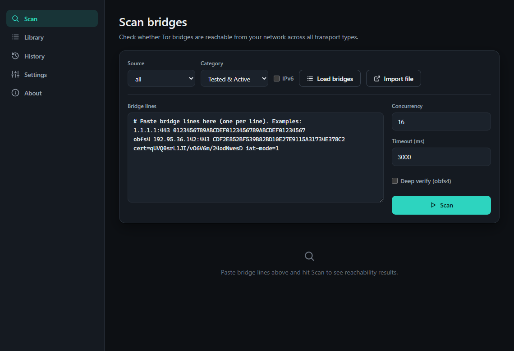

# BridgeHop

A lightweight, cross-platform **Tor bridge reachability scanner** with a modern UI.



BridgeHop tests whether Tor bridges are reachable from your network across **all bridge
types** — `vanilla`, `obfs4`, `webtunnel`, `snowflake`, `meek`, `conjure`, and `dnstt` — so
you can quickly find bridges that actually work where you are. It ships with built-in bridge
lists and live sources, and you can add your own.

Built with [Tauri](https://tauri.app) (a small Rust core + web UI) and a matching command-line
companion that shares the same engine.

## Features

- **Reachability checks for every transport**
  - Fast TCP-connect probe for direct transports (`vanilla`, `obfs4`, …).
  - Front-host TLS probe on `:443` for fronted/broker transports (`snowflake`, `meek`,
    `conjure`, `dnstt`, `webtunnel`) — a completed TLS handshake confirms fronting works.
- **Built-in lists & live sources** — the community bridge collector (with mirror fallback),
  built-in defaults for fronted transports, and your own bridges (pasted or imported from a file).
  Fetched lists are cached and served (stale) when you're offline.
- **Deep verify** (desktop) — optionally launch the real obfs4 client (lyrebird/obfs4proxy) to
  confirm an actual handshake; prompts you to install it if it's missing.
- **Scan history & reliability** — every scan is recorded; the Library ranks bridges by uptime
  and latency across runs.
- **Import / export** — plain lines, `torrc`, JSON files, and per-bridge QR codes for sharing.
- **CLI companion** — scriptable scanning and exporting that shares the app's engine and database.
- **8 languages** — English, German, French, Russian, Simplified Chinese, South Azerbaijani,
  Central Kurdish, and Persian (right-to-left supported).
- **Modern, responsive UI** — light/dark theming, live result streaming, and a mobile layout.

## Architecture

```
crates/bridgehop-core   # parsing, scanning engine, sources, storage, import/export
crates/bridgehop-cli    # command-line companion (binary: `bridgehop`)
src-tauri               # Tauri desktop shell (thin command/event layer)
ui                      # SvelteKit + Tailwind front end (static SPA)
```

All logic lives in `bridgehop-core`; the desktop app and CLI are thin shells over it.

## Building from source

Requirements: a recent stable [Rust](https://rustup.rs) toolchain and
[Node.js](https://nodejs.org) 20+. (Linux also needs the WebKitGTK dev packages — see the
release workflow for the exact list.)

```sh
# Install dependencies
npm install            # root: Tauri CLI
npm --prefix ui install

# Run the desktop app in dev mode
npm run dev

# Build the desktop app (installer/bundle)
npm run build

# Build & use the CLI
cargo build --release -p bridgehop-cli
target/release/bridgehop sources --list
target/release/bridgehop scan --source obfs4 --category tested
cargo test --workspace --exclude bridgehop-app
```

### Android

BridgeHop also builds for Android (arm64). The desktop-only pieces — native file
dialogs and deep verify, which spawns pluggable-transport clients — are compiled out;
everything else (scanning every transport, live sources, history, QR) works on mobile.

Requires the Android SDK + NDK and a JDK 17. With `ANDROID_HOME` and `NDK_HOME` set:

```sh
rustup target add aarch64-linux-android
npm run tauri -- android init
npm run tauri -- android build --apk --debug --target aarch64
# → src-tauri/gen/android/app/build/outputs/apk/.../*.apk
```

## CLI usage

```sh
bridgehop scan --file bridges.txt              # scan lines from a file
bridgehop scan --source all --category tested  # fetch from a source, then scan
cat bridges.txt | bridgehop scan               # scan from stdin
bridgehop sources obfs4 --category full-archive # fetch a list
bridgehop export --source snowflake --format torrc
bridgehop history                              # recent scan runs
bridgehop history --reliability                # per-bridge uptime leaderboard
```

## Releases

The release workflow (run on a `v*` tag or manually) builds the desktop bundles for Windows,
Linux, and macOS, the CLI for each platform, and an Android arm64 APK, and uploads them all to a
draft GitHub Release. Code signing is left to the maintainer (configure the relevant secrets in
the workflow); the Android APK is debug-signed for sideloading.

## License

BridgeHop is free software, licensed under the
[GNU General Public License v3.0 or later](LICENSE).
